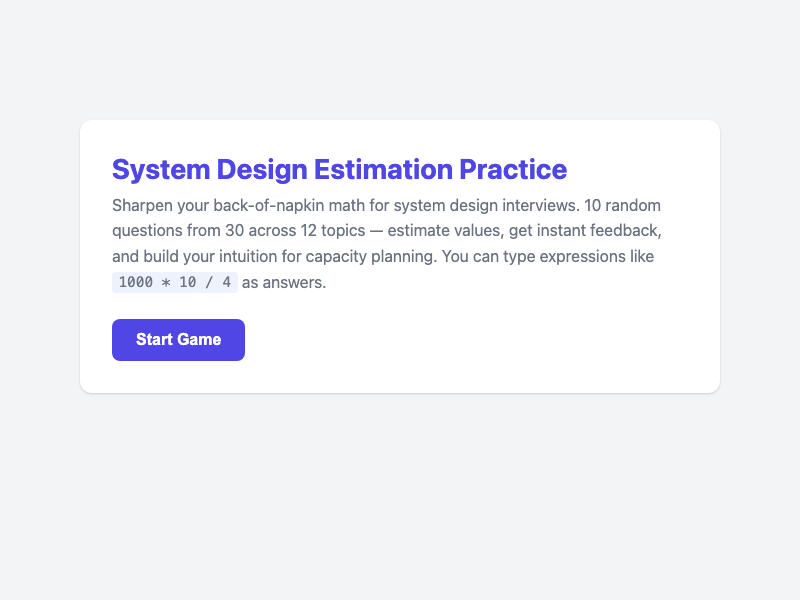

# System Design Estimation Practice

A gamified, Anki-style web app for practicing back-of-napkin math for system design interviews. 10 random questions per round from a bank of 30, covering 12 system design topics.



## Features

- **30 questions across 12 topics**: APIs, Databases, Scaling, CAP Theorem, Auth & Security, Load Balancers, Caching, Message Queues, Indexing, Failovers, Replication, Consistent Hashing
- **Expression input**: Type calculations like `1000 * 10 / 4` directly in the answer box
- **Instant feedback**: Correct/incorrect with directional hints (too high/too low), reference answers, explanations, and tips
- **Score tracking**: Per-topic breakdown after each game, historical scores persisted in localStorage
- **10 random questions per game**: Different mix each time from the full question bank

## Usage

Open `index.html` in a browser, or visit [system-design-math-practice.tzvi.dev](https://system-design-math-practice.tzvi.dev).

## Auditing Questions

A CLI tool is included to audit and update questions using Claude Code:

```bash
# Audit all questions — checks math, ranges, explanations
./tools/audit-questions.sh

# Audit and auto-apply fixes
./tools/audit-questions.sh --fix
```

## Tech Stack

Vanilla HTML/CSS/JS — no framework, no build step. Deployed to GitHub Pages.
